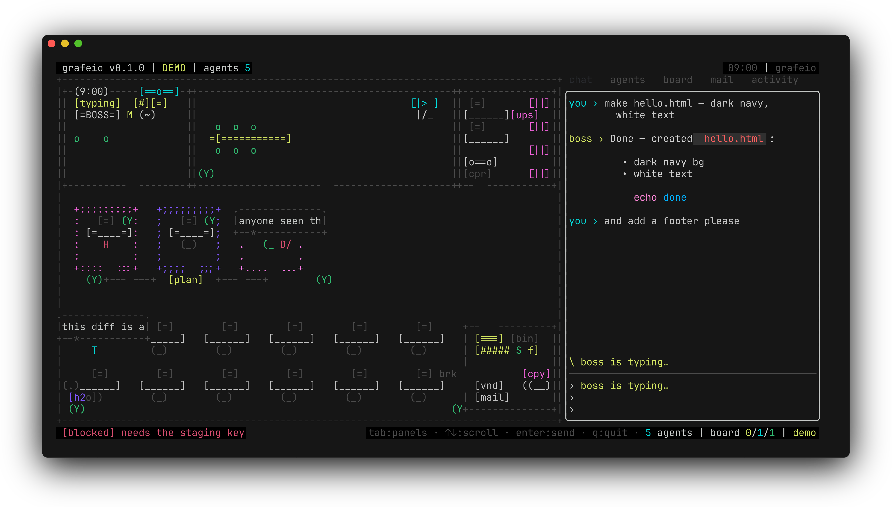
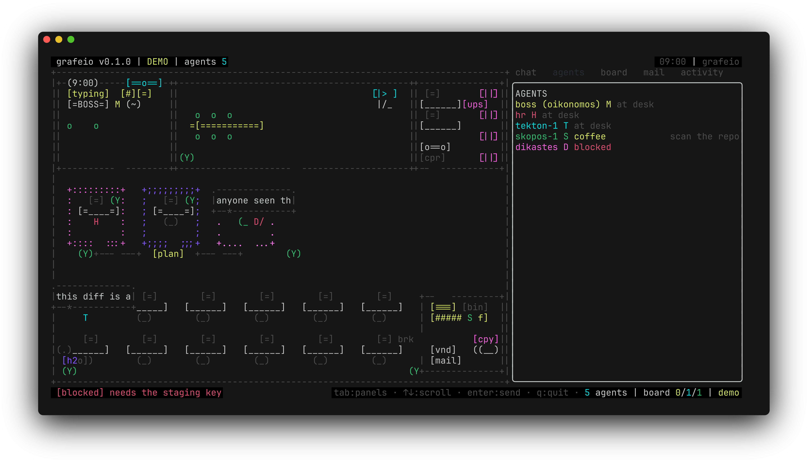
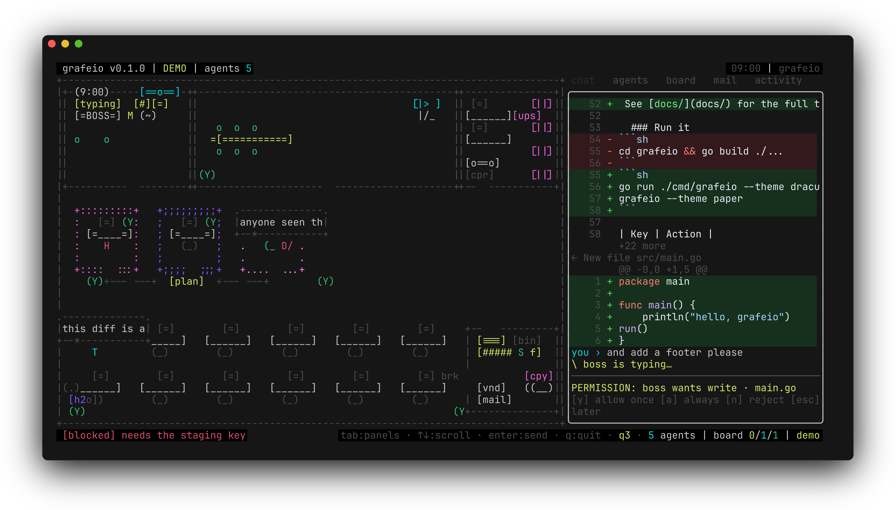
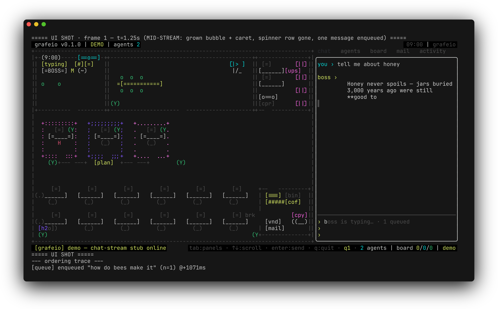

# Grafeio (γραφείο)

**A startup office in your terminal, staffed by real agents.** (v2 — Go + Bubble Tea)

Chat with the boss. Watch the floor — employees get up, walk to the manager,
take the task, type it out, drop the mail, hit the tea machine. The right panel
is yours: chat, agents, board, mail, activity — switch with `tab`.

Underneath the wallpaper, it's all real: the manager is
**[Oikonomos](https://github.com/theboringhumane/oikonomos)**, the employees
are **opencode sub-agents**, the task board is **agentmemory actions**, the
mail room is **agentmemory signals**.



```bash
go install github.com/theboringhumane/grafeio/cmd/grafeio@latest

grafeio            # live: spawns `opencode serve`, real boss (oikonomos)
grafeio --demo     # touring mode: simulated events, labeled DEMO
grafeio --server http://127.0.0.1:4096   # attach to an existing server
```



Working detail stays visible: opencode-style diffs (line numbers, full-row
red/green tints, inline syntax), thinking blocks, tool calls, permission
prompts (`[y/a/n/esc]`), question prompts, and a message queue that never
locks you out while the boss types.



Everything live-streams: the boss's replies type out character-by-character on
one bubble, and thinking transcripts unfold in real time before auto-collapsing.



And the queue is not a tunnel — it's a **backlog the office manages**: items get
board rows, flush goes out as one `[BATCH DISPATCH]` the boss decomposes into
parallel sub-agents (`/route` forces it early), and a dead boss respawns a fresh
session and resends the batch.

## Configure the brain

One file runs the office: **`~/.grafeio/configs/brain.json`** (created with
defaults on first run; inspect anytime with `grafeio --print-default-config`).

```jsonc
{
  "boss":    { "name": "boss (oikonomos)", "model": "anthropic/claude-sonnet-4-5" },
  "roles":   { "developer": { "namePrefix": "tekton" }, "scout": { "namePrefix": "skopos" },
               "reviewer": { "namePrefix": "dikastes" }, "runner": { "namePrefix": "hemerodromos" } },
  "ui":      { "theme": "noir", "power": "auto", "tickMs": 0, "ambientChatter": true,
               "sounds": "on", "sidebarWidth": 0, "compact": false },
  "backend": { "agentmemoryUrl": "http://localhost:3111", "server": "", "agentmemoryPollS": 5 }
}
```

Boss model rides every prompt as `{"model":{"providerID","modelID"}}` (serve
1.18.19 `/doc`-verified). Role models are noted as best-effort (sub-agent model
dispatch is opencode's call). `/power`, `/model`, `/theme` all write back.

### Battery (`ui.power`)

| mode | busy | idle | drift (1 min quiet) |
|---|---|---|---|
| `auto` (default) | 180ms ticks | 1s | 3s |
| `performance` | 150ms flat | — | — |
| `saver` | 400ms | 2s | — |

Idle-detection covers streaming, pending replies, walkers, open modals, ambient
bubbles. Renders are memoized (frame digest on the app, `(size, planGen, tick,
renderRev)` on the floor), the agentmemory board poll backs off 2× after five
quiet syncs (cap 4×, reset on change). The office goes cheap when nothing moves.

## The sidebar is a cockpit

Six tabs with a real terminal in the middle:

- **terminal** — an OS shell (`$SHELL`) on a real PTY, by `creack/pty`:
  lazily spawned on first visit, resizes with the panel, mouse scrolls the
  scrollback, `r` respawns when dead, `ctrl+o` releases focus, `ctrl+q` still
  quits everything.
- **chat** — the boss conversation; **agents** / **board** / **mail** /
  **activity** — office telemetry.

Layout lives in the config *and* in the app:

```text
/compact on|off     narrow sidebar (30) + short tab letters + 2-row input
/mode normal|compact   same, persisted to brain.json
/wide <n>           sidebar width 26..80 (0 = default 68), persisted
/zen                fullscreen floor, minimal chrome — any key exits
```

Sounds: `ui.sounds = on | bell | off` (or `GRAFEIO_MUTE=1`).

## Keys

| key | does |
|---|---|
| `tab` / `shift+tab` / `1..6` | switch panel: chat · **terminal** · agents · board · mail · activity |
| `↑` `↓` `pgup` `pgdn` / wheel | scroll the active panel |
| `enter` | send to the boss (chat) |
| `shift+enter` | newline |
| `@` at a word start (chat) | open the attach-file picker — `↑`/`↓` choose · `enter`/`tab` attach · `esc` close |
| `ctrl+v` (chat) | paste text — attaches the image instead when the clipboard holds one (macOS: `pngpaste` or osascript) |
| `backspace` on an empty input | drop the newest attachment chip |
| `ctrl+t` | expand/collapse completed thinking blocks |
| `ctrl+d` | expand/collapse diff blocks |
| `ctrl+o` | release the embedded terminal's focus back to the panels |
| `ctrl+q` | quit (works inside the embedded terminal too) |
| `y` `a` `n` `esc` | answer a permission prompt |
| `q` / `ctrl+c` | quit |

Attachments stage as dim `📎` chips above the input (cap 5 — the oldest
drops past it), ride the message queue like text, and go out as prompt file
parts; the echoed user bubble shows a `· 📎 N` suffix. `/clear` or a send
clears the chips.

## What v2 (Go) changed

- Chat moved from a fixed bottom bar into a **tabbed right panel** with
  **glamour-rendered markdown** — the boss's `**bold**`, lists and code fences
  format and wrap inside the panel instead of bleeding through the UI.
- Scrolling everywhere (viewport), mouse wheel, multi-line input, typing
  spinner while the boss works.
- New **activity** tab: rolling event log (dispatches, returns, blocks).
- Native single binary. Themes: `--theme noir|paper|mono|dracula|solarized`
  (also `/theme` in-app, persisted to `~/.config/grafeio/theme`).
- Slash commands in chat: `/help /themes /theme <n> /thinking on|off
  /tools on|off /status /clear /quit`.
- The Ink/Node v0.1 app lived on as git tag `node-v0.1.0`.

## Behind the glass

- The boss is a real `opencode serve` primary session — oikonomos manages.
- Employees are real `task` sub-agent sessions (SSE → hire/dispatch/working/returned).
- `docs/shots-go/*` are produced by the app itself + [freeze](https://github.com/charmbracelet/freeze)
  (deterministic scripted backends: `go run ./cmd/uishot`, `go run ./cmd/floorshot`).

Architecture and the floor plan: [docs/architecture.md](docs/architecture.md).

MIT © Lynxlabs
