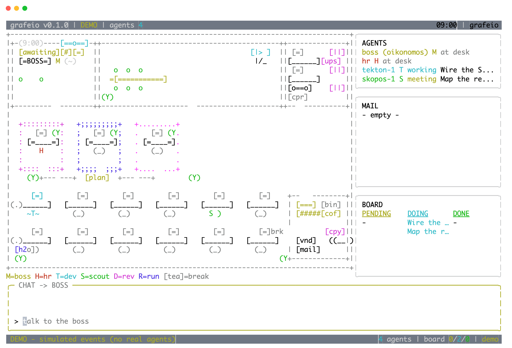
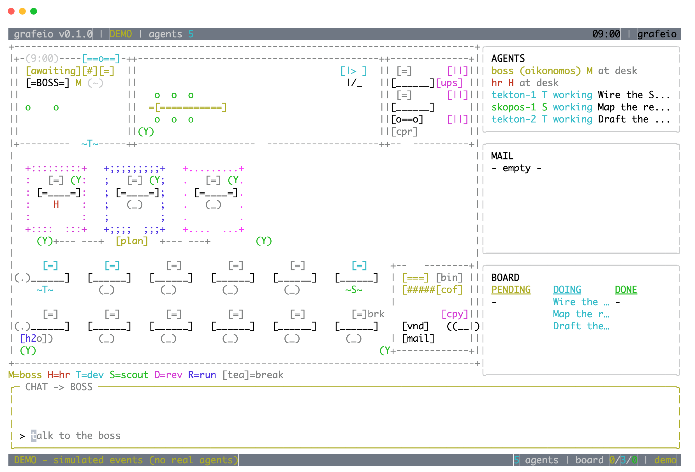
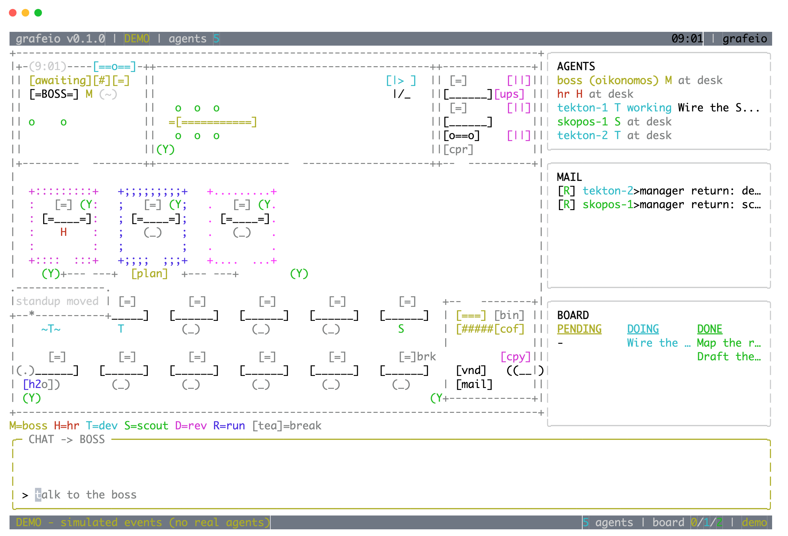

# Grafeio (γραφείο)

**A startup office in your terminal, staffed by real agents.**

Chat with the boss. Watch the floor — employees get up, walk to the manager,
take the task, type it out, drop the mail, hit the tea machine. The board on
the right tracks pending/in-progress/completed. The mail tray on the left
carries every brief and return. HR keeps the roster.

Underneath the wallpaper, it's all real: the manager is **Oikonomos**, the
employees are **opencode sub-agents**, the task board is **agentmemory
actions**, the mail room is **agentmemory signals**.

```bash
npm i -g grafeio
grafeio            # attach to your opencode install (spawns `opencode serve`)
grafeio --demo     # touring mode: simulated events, no install required
```

Layout (fullscreen, opencode-style chrome):

```
+ topbar: grafeio v0.1.0 | MODE | agents n                    clock +
+------------------------------------------------+-------------+
|  FLOOR (animated office)                       |  AGENTS     |
|  boss office · conference · cabins · pods ·    |  ---------- |
|  tea machine · break room                      |  MAIL       |
|                                                |  ---------- |
|                                                |  BOARD      |
+------------------------------------------------+-------------+
|  CHAT -> the boss (oikonomos)                              |
+-------------------------------------------------------------+
|  statusbar: statusLine            n agents | board p/i/d    |
+-------------------------------------------------------------+
```

## Gallery (real renders, `npx tsx scripts/to-png.ts`)

Early shift — staffing, boss awaiting:



Mid shift — three briefs in flight, screens lit:



Late shift — returns landing in MAIL, tasks moving to DONE, office chatter:



Requirements: Node 20+, opencode (`brew install anomalyco/tap/opencode`) for
the live mode.

Architecture: [docs/architecture.md](docs/architecture.md) — deliberately
small enough to hold in your head.

MIT © Lynxlabs
